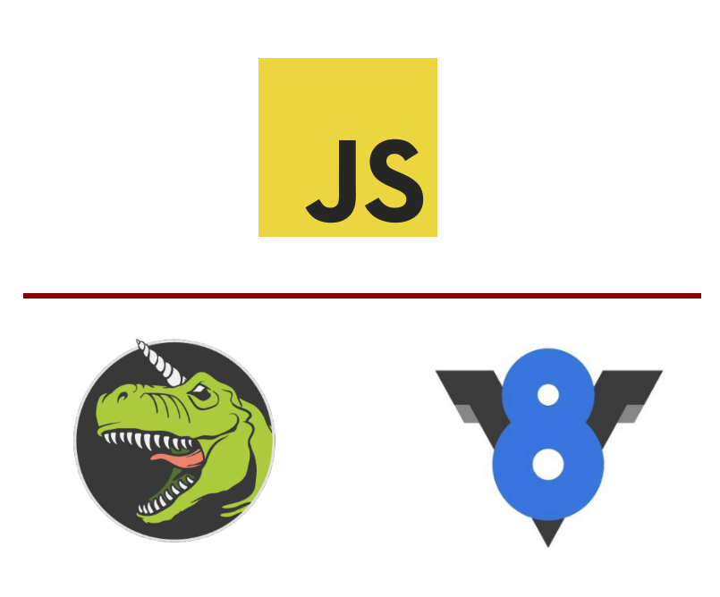
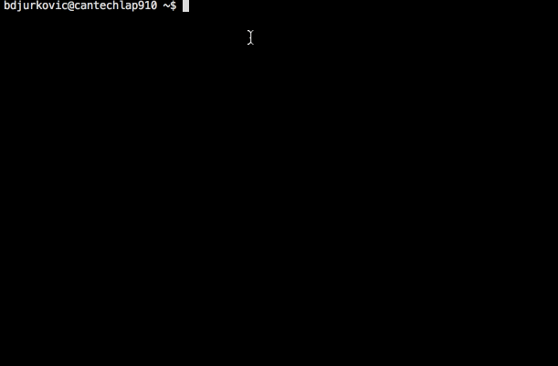
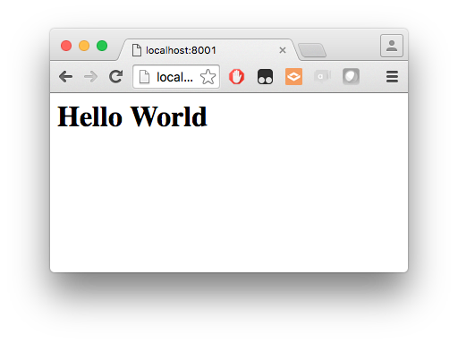
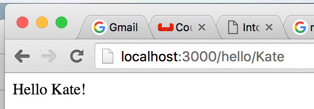

# Intro to Node.js

### Bojan D.

FDUG May 25, 2016  

=====

### Node.js

* Server-side JavaScript
* Open-source
* Cross-platform
* Event-driven
* Asynchronous I/O
* Single threaded model

NOTES:
_[1 minutes]_

- Server side JS. Some people believe JS doesn't belong on the server, but too bad.
- Single threaded. Weird for people coming from other platforms. There are modules such as the native module
  `cluster` that enable parallelism.

=====

### Who uses Node.js

<table>
  <tr style="border:none">
    <td style="border:none">
			
		</td>
		<td style="border:none">
			
		</td>
		<td style="border:none">
			
		</td>
	</tr>
	<tr style="border:none">
		<td style="border:none">
			
		</td>
		<td style="border:none">
			
		</td>
		<td style="border:none">
			
		</td>
	</tr>
	<tr style="border:none">
		<td style="border:none">
			
		</td>
		<td style="border:none">
			
		</td>
		<td style="border:none">
			
		</td>
	</tr>
  <tr style="border:none">
		<td style="border:none">
			
		</td>
		<td style="border:none">
			
		</td>
		<td style="border:none">
			
		</td>
	</tr>
</table>

NOTES:
_[1 minutes]_

- Medium. Initially all in Node. Now most of the main services still in Node, with some auxiliary services in Go.
- Voxer.io.
- Klout

=====

Platforms

<table>
  <tr style="border:none">
		<td style="border:none">
			
		</td>
		<td style="border:none">
			
		</td>
		<td style="border:none">
			
		</td>
	</tr>
	<tr style="border:none">
		<td style="border:none">
			
		</td>
		<td style="border:none">
			
		</td>
		<td style="border:none">
			
		</td>
	</tr>
</table>

NOTES:
_[1 minutes]_

- Tessel - open source board similar to Arduino or Raspberry Pi, with native Node.js built in.
- Electron - Open Source Node.js framework to target desktop environments. Atom, Slack among others.
- Also able to target Arduino, Raspberry Pi, drones, and others using Cylon.js or JohnnyFive.

=====

### Node.js Architecture Overview



NOTES:
_[1 minutes]_

- libuv, multiplatform C library that supports the evented, asynchronous I/O architecture of Node.js
- V8 - Google Javascript Engine (in C++) that executes the code
- Experimental support for ChakraCore, and Spider Monkey

=====

### More depth


NOTES:
_[1 minutes]_

=====

### NPM

```json
{
  "name": "module-name",
  "version": "1.3.1",
  "description": "An example module to illustrate the usage of a package.json",
  "author": "Your Name <you.name@example.org>",
  "bin": {
    "module-name": "./bin/module-name"
  },
  "scripts": {
    "test": "mocha",
    "start": "node dist/index.js",
    "predeploy": "echo im about to deploy",
    "postdeploy": "echo ive deployed",
    "prepublish": "babel lib --out-dir dist"
  },
  "main": "dist/foo.js",
  "repository": {
    "type": "git",
    "url": "https://github.com/bojand/foolib"
  },
  "bugs": {
    "url": "https://github.com/bojand/foolib/issues"
  },
  "keywords": [ "node", "example", "npm" ],
  "dependencies": {
    "async": "^1.5.0",
    "lodash": "^4.10.0"
  },
  "devDependencies": {
    "chai": "^3.5.0",
    "express": "^4.13.0",
    "mocha": "^2.4.5"
  },
  "license": "MIT"
}
```

NOTES:
_[1 minutes]_

=====

### In action...


NOTES:
_[1 minutes]_

=====

### nvm



NOTES:
_[1 minutes]_

=====

### REPL


NOTES:
_[1 minutes]_

- read–eval–print loop

=====

### Simple command line tool

```js
function greet(name) {
  console.log(`Hello ${name}`);
}

greet(process.argv[2]);
```

```sh
$ node simple-cli.js Dave
Hello Dave!
$
```

NOTES:
_[1 minutes]_

=====

### We can do better

```js
var program = require('commander');

program
  .version('1.0.0')
  .option('-g, --greeting [greeting]', 'Specify greeting')
  .option('-n, --name [name]', 'Specify name')
  .parse(process.argv);

console.log(`${program.greeting} ${program.name}!`);
```

```sh
$ node better-cli.js --help

  Usage: better-cli [options]

  Options:

    -h, --help                 output usage information
    -V, --version              output the version number
    -g, --greeting [greeting]  Specify greeting
    -n, --name [name]          Specify name

$ node better-cli.js -g Hello -n Dave
Hello Dave!
$
```

NOTES:
_[1 minutes]_

=====

### Events

* Much of the Node.js API is built around an asynchronous event-driven architecture in which "emitters" periodically emit named events that cause "listeners" to be called.

```js
const EventEmitter = require('events');
class MyEmitter extends EventEmitter {}
const myEmitter = new MyEmitter();
myEmitter.on('event', function () {
  console.log('an event occurred!');
});
myEmitter.emit('event');
```

NOTES:
_[1 minutes]_

- This code is actually synchronous, and it all happens on a single tick.
- In reality most events occur in asynchronous contexts.

=====

### I/O - File System

```js
var fs = require('fs');
console.log('reading file');
fs.readFile('file.txt', 'utf8', function (err, data) {
  if (err) throw err;
  console.log(data);
	fs.writeFile('file2.txt', data, function (err) {
	  if(err) throw err;
	  console.log('all done!');
	});
});
console.log('end of code');
```

```sh
$ node io.js
reading file
end of code
Lorem ipsum dolor sit amet, consectetur adipiscing elit, sed do eiusmod tempor incididunt ut labore et dolore magna aliqua.

all done!
$
```

NOTES:
_[2 minutes]_

- Important to notice the flow and order of execution

=====

### I/O - Database

```js
var level = require('level');

// 1) Create our database, supply location and options.
//    This will create or open the underlying LevelDB store.
var db = level('./mydb', { valueEncoding: 'json' });

// 2) put a key & value
db.put('key-123', { foo: 'bar' }, function (err) {
  if (err) return console.log('Ooops!', err); // some kind of I/O error
  // 3) fetch by key
  db.get('key-123', function (err, value) {
    if (err) return console.log('Ooops!', err); // likely the key was not found
    console.log(value);
  });
});
```

```sh
$ node db.js
{foo: 'bar'}
$
```

NOTES:
_[2 minutes]_

- Important to notice the flow and order of execution
- LevelDB is a simple key/value data store built by Google, inspired by BigTable. It's used in Google Chrome and many other products. Data is sorted by key. It supports batching writes, forward and backward iteration. It's got lots of nice features like streaming API which makes it a good fit for use with Node.js Think of it as a NoSQL key-value based SQLite.

=====

### Streams

```js
var fs = require('fs');
var readableStream = fs.createReadStream('file.txt');
var data = '';

readableStream.setEncoding('utf8');

readableStream.on('data', function (chunk) {
  data += chunk;
});

readableStream.on('end', function () {
  console.log(data);
});
```

NOTES:
_[2 minutes]_

- Problem with file example earlier? We have to wait and read whole file into memory before we can do anything with it.
- Extending on events, streams are an integral aspect of Node.js.

=====

### Types of streams

* Readable
	- abstraction for a source of data that you are reading from
	- data comes *out* of a Readable stream
* Writable
	- abstraction for a destination that you are writing data to
* Duplex
	- Implement both Readable and Writable interface
* Transform
	- Specialized Duplex stream where the output is computed from input

NOTES:
	_[2 minutes]_

=====

### Piping

```js
var fs = require('fs');
var readableStream = fs.createReadStream('file1.txt');
var writableStream = fs.createWriteStream('file2.txt');

readableStream.pipe(writableStream);
```

Let's emulate `cat`

```js
process.stdin.pipe(process.stdout);
```

NOTES:
_[1 minutes]_

=====

### Chaining

```js
var fs = require('fs');
var zlib = require('zlib');

var r = fs.createReadStream('file.txt');
var z = zlib.createGzip();
var w = fs.createWriteStream('file.txt.gz');

r.pipe(z).pipe(w);
```

NOTES:
_[1 minutes]_

=====

### We can do it

```js
var fs = require('fs');
var stream = require('stream');

var yell = new stream.Transform({
  transform: function(chunk, encoding, next) {
    this.push(chunk.toString().toUpperCase());
    next();
  }
});

var r = fs.createReadStream('file.txt');
var w = fs.createWriteStream('FILE2.txt');
r.pipe(yell).pipe(w);
```

NOTES:
_[1 minutes]_

=====

### Simple Server

```js
const http = require('http');

const server = http.createServer(function (req, res) {
  res.end('<h1>Hello World</h1>');
});

server.listen(8001);
```



NOTES:
_[1 minutes]_

=====

### Serve a file

```
var http = require('http');
var fs = require('fs');

var server = http.createServer(function (req, res) {
  fs.readFile('file.txt', function (err, data) {
    res.end(data);
  });
});

server.listen(8000);
```

NOTES:
_[2 minutes]_

- `res` is just a stream. We can do better.

=====

### Improvement using streams

```js
var http = require('http');
var fs = require('fs');

var server = http.createServer(function (req, res) {
  var stream = fs.createReadStream('file.txt');
  stream.pipe(res);
});
server.listen(8000);
```

NOTES:
_[1 minutes]_

=====

### Express

```js
var express = require('express');
var app = express();

app.get('/', function (req, res) {
  res.send('Hello World!');
});

app.listen(3000, function () {
  console.log('Example app listening on port 3000!');
});
```

NOTES:
_[2 minutes]_

- Express is the de facto web framework for Node.js applications.
- Others:
  * Restify
  * Sails.js. Built on top of Express.
  * Kraken, et al. From PayPal. Built on top of Express.
  * Koa.js. Next generation, ES6 version of Express.

=====

### Middleware

```js
var express = require('express');
var uuid = require('uuid');
var app = express();

function requestId(req, res, next) {
  if(!req.get('X-Request-Id')) req.headers['x-request-id'] = uuid.v4();
  req.requestId = req.get('X-Request-Id');
  res.setHeader('X-Request-Id', req.requestId);
  next();
}

function logger(req, res, next) {
  console.log(`${req.method} ${req.url} Request ID: ${req.requestId}`);
  next();
}

app.use(requestId);
app.use(logger);

app.get('/hello/:name', function (req, res) {
  res.send(`Hello ${req.params.name}!`);
});

app.listen(3000, function () {
  console.log('Example app listening on port 3000!');
});
```

NOTES:
_[3 minutes]_

- Express has a concept of middleware that are just functions that can be hooked up as layers within request - response cycle.

=====



```sh
$ node mw.js
Example app listening on port 3000!
GET /hello/Dave Request ID: 43b9638e-ce1e-49cb-8a5a-a659e5c47fb8
GET /hello/Kate Request ID: c30531d6-1a3c-47b7-b72c-bff2c5d3bc12
```

NOTES:
_[1 minutes]_

=====

### Middleware ecosystem

* Logging
* Body parsing
* Cookies, Session
* Authentication
* Error handling
* Serving static files
* Data validation
* Compression
* Security, CORS

NOTES:
_[1 minutes]_

=====

### API Example

```js
var express = require('express');
var bodyParser = require('body-parser');
var morgan = require('morgan');
var addRequestId = require('express-request-id')();
var api = require('./users');

var app = express();

// set up id token for logging
morgan.token('id', function getId(req) {
  return req.id
});

app.use(bodyParser.json());
app.use(addRequestId);
app.use(morgan(':method :url :status :response-time ms - :id'));

app.get('/users', api.list);
app.get('/users/:email', api.get);
app.post('/users', api.create);
app.put('/users/:email', api.update);
app.patch('/users/:email', api.update);
app.delete('/users/:email', api.delete);

app.listen(3000, function () {
  console.log('User API listening on port 3000!');
});
```

NOTES:
_[5 minutes]_

=====

### API Implementation

```js
var hl = require('highland');
var level = require('level');
var _ = require('lodash');
var db = level('./apidb', { valueEncoding: 'json' });

exports.get = function (req, res, next) {
  db.get(req.params.email, function (err, value) {
    if (err) {
      if (err.notFound) { return res.sendStatus(404); }
      return res.status(500).send(err.message);
    }
    return res.send(value);
  });
}

exports.create = function (req, res, next) {
  var key = req.body.email;
  if (!key) { return res.status(400).send('Email required.'); }

  db.put(key, req.body, function (err) {
    if (err) { return res.status(500).send(err); }
    return res.status(201).send(req.body);
  });
}

exports.update = function (req, res, next) {
  var key = req.params.email;
  db.get(req.params.email, function (err, value) {
    if (err) {
      if (err.notFound) { return res.sendStatus(404); }
      return res.status(500).send(err.message);
    }

    var data = req.method === 'PUT' ? req.body : _.merge({}, req.body, value);
    db.put(key, data, function (err) {
      if (err) { return res.status(500).send(err); }
      return res.status(200).send(data);
    });
  });
}

exports.delete = function (req, res, next) {
  db.del(req.params.email, function (err) {
    if (err) {
      if (err.notFound) { return res.sendStatus(404); }
      return res.status(500).send(err.message);
    }
    res.sendStatus(200);
  })
}

exports.list = function (req, res, next) {
  res.setHeader('content-type', 'application/json');
  var dbstream = db.createValueStream({ valueEncoding: 'utf8' });
  var dataStream = hl(dbstream).intersperse(',');
  hl(['[']).concat(dataStream).concat(hl([']'])).pipe(res);
}
```

NOTES:
_[5 minutes]_

- Demo

=====

### Reading streams client-side

* We should exploit advantages of streams on client-side

```js
var oboe = require('oboe');
var url = 'http://localhost:3000/users';
oboe(url).on('node', '{email firstName lastName}', function (user) {
  console.log(`USER: ${user.email} ${user.firstName} ${user.lastName}`)
});
```

```sh
$ node stream-client.js
USER: Trites@gmail.com Andrew Trites
USER: dbojan2@gmail.com Bojan2 Djurkovic2
USER: dbojan@gmail.com Bojan Djurkovic
USER: jamie@gmail.com Jamie Curtis
$
```

NOTES:
_[3 minutes]_

- We can asynchronously render data in browser as it becomes available.
- You can imagine how this can be hooked up to React / Redux to add components for items as they become available.

=====

### Automated testing
<span>
	&nbsp;
	
</span>
<br />
<span>
  &nbsp;
	

</span>

NOTES:
_[3 minutes]_

* Mocha
	- synchronous execution
	- Use any assertion library
* Jest
  - From Facebook
	- Jasmine for assertions
	- atomic tests
	- async and sync
	- support for ES6 using Babel plugin
	- mocking support
* AVA
	- built-in ES6 support
	- concurrent, async tests by default
	- enforces atomic tests
	- own assertion API
* chai - assertion library with many plugins

=====

### Mocha

```js
var sum = require('my-sum-lib');
var expect = require('chai').expect;

describe('sum module', function() {
  it('should add two numbers together', function() {
    var r = sum.addSync(3, 4);
    expect(r).to.equal(7);
  });

  it('should add two numbers together async', function(done) {
    sum.add(3, 4, function(r) {
      expect(r).to.equal(7);
      done();
    });
  });
})
```

NOTES:
_[3 minutes]_

=====

### Endpoint testing using AVA

```js
import test from 'ava';
import request from 'supertest-as-promised';

test('POST /users', async t => {
  t.plan(2);

  const data = {
    email: 'dbojan+test@gmail.com.com',
    firstName: 'Test',
    lastName: 'User'
  };

  const res = await request('http://localhost:3000')
    .post('/users')
    .send(data);

  t.is(res.status, 201);
  t.deepEqual(res.body, data);
});
```

NOTES:
_[3 minutes]_

=====

### Debugging

* Node Inspector is the main debugging tool for Node.js applications.

```sh
$ npm install -g node-inspector
$ node-debug app.js
```

### Profiling

- `$ node --prof app.js`
- `heapdump` and `memwatch` tools

NOTES:
_[2 minutes]_

=====

### Questions?
